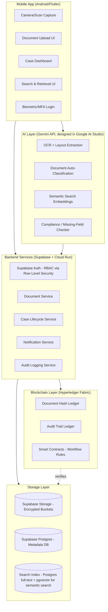

# Secure Digital Document Management System (DMS)
### For Legal & Investigation Documents — NCRB, Women Safety Division
**Theme:** Blockchain & Cybersecurity | **Problem Statement ID:** 26190

---

## 1. Executive Summary

This document details the full technical blueprint for a **Secure Digital Document Management System** delivered as a **mobile-first application**, built using **Google AI Studio (Gemini API prototyping)** integrated with **Firebase Studio / Android Studio** for production app development. The system digitizes, secures, and manages the lifecycle of legal and investigative documents (FIRs, charge sheets, witness statements, forensic reports, court filings) with blockchain-backed integrity, AI-assisted search and classification, and strict role-based access control.

A clarifying note on tooling: **Google AI Studio** is Google's environment for designing, testing, and tuning prompts against Gemini models (via the Gemini API) — it is not itself a mobile app builder. The actual mobile application is built in **Android Studio (Kotlin/Jetpack Compose)** or **Flutter**, with the Gemini model — designed and validated in AI Studio — wired in as a backend AI service through the Gemini API. This is the correct, real-world pipeline, and it's what this document describes end-to-end.

---

## 2. Problem Statement Requirement Mapping

| SIH Requirement | How This Solution Addresses It |
|---|---|
| Digitize & centralize document storage | Mobile scan-to-cloud pipeline with OCR, auto-upload to encrypted centralized storage |
| Secure access & confidentiality | RBAC + biometric/MFA authentication + AES-256 encryption at rest & in transit |
| Prevent unauthorized modifications | Blockchain-anchored document hashes; any edit creates a new immutable version |
| Complete audit trail | Every action (view/edit/share/download) logged as a blockchain transaction |
| Efficient search & retrieval | Gemini-powered semantic search + metadata/full-text search (Elasticsearch) |
| Collaboration among stakeholders | Secure, expiring, watermarked cross-department sharing with granular permissions |
| Compliance with legal/regulatory requirements | Built-in mapping to IT Act 2000 §65B (digital evidence admissibility), audit exports for court |
| Asset lifecycle monitoring (Expected Solution) | Case & evidence lifecycle tracker with status states, custody chain, and automated retention/archival rules |

---

## 3. What Makes This Different From Existing Market Solutions

Most existing government/legal DMS products (e.g., CCTNS, generic e-Office systems, legacy police record software) share common weaknesses this system directly targets:

| Existing Apps | This System |
|---|---|
| Centralized DB only — single point of tampering | Blockchain-anchored hash ledger makes silent tampering mathematically detectable |
| Keyword-only search | **AI semantic search** — "find witness statements mentioning a red vehicle near the market" works even without exact keyword match |
| Manual document classification | **Auto-classification** of scanned documents into FIR/charge sheet/forensic report/etc. via Gemini vision + NLP at upload time |
| Static audit logs (editable DB tables) | Audit trail is **blockchain-backed** — cannot be silently altered even by a DB admin |
| Desktop-first, poor field usability | **Mobile-first**, offline-capable app for officers filing FIRs or uploading evidence directly from the field |
| No chain-of-custody visualization | Visual **evidence custody chain timeline** per document/case, showing every handler |
| Generic access control | **Context-aware access**: an officer only sees documents for cases they are assigned to, dynamically revoked on reassignment/closure |
| No tamper-evidence for photos/videos | Evidence media (photos of crime scene, etc.) hashed and blockchain-anchored **at the moment of capture** via the app's camera, preventing post-capture manipulation claims |
| No proactive compliance checks | AI flags missing mandatory fields/signatures before a document can be marked "filed," reducing procedural rejection in court |

---

## 4. High-Level Architecture



---

## 5. End-to-End Pipeline

### Stage 1 — Capture & Ingestion (Mobile)
1. Officer/authorized user logs in via **biometric + MFA**.
2. Captures a document (photo/scan) or uploads an existing file within the app.
3. App computes a **local SHA-256 hash** of the raw file *before* any upload — this becomes the tamper-evidence baseline.
4. File is encrypted client-side (AES-256) before transmission.

### Stage 2 — AI Processing
1. **OCR** (Gemini vision capabilities, tuned in Google AI Studio) extracts text from the scanned document, including handwritten sections where feasible.
2. **Auto-classification** model tags the document type (FIR, charge sheet, forensic report, witness statement, etc.).
3. **Metadata extraction**: case number, date, names, sections of law cited — pulled via structured Gemini prompts (JSON-mode output validated in AI Studio).
4. **Compliance checker** flags missing mandatory fields (e.g., signature block, officer ID) before the document can proceed to "filed" status.
5. **Embedding generation** for semantic search indexing.

### Stage 3 — Secure Storage
1. Encrypted file stored in **Supabase Storage** (encrypted buckets, signed URLs with expiry; on-prem MinIO as an alternative for air-gapped deployments).
2. Metadata written to **Supabase Postgres**, with **Row Level Security (RLS)** policies enforcing case-level and role-level access directly at the database layer — a strong fit for RBAC/ABAC in this system.
3. Search embeddings written to Postgres using the **pgvector** extension (keeps semantic search in the same database rather than a separate Elasticsearch cluster — simpler ops for an MVP/hackathon timeline).
4. The original hash (from Stage 1) + a hash of the final stored object is submitted as a transaction to the **Hyperledger Fabric ledger**.

### Stage 4 — Blockchain Anchoring
1. Smart contract validates the submitting user's role/permission before accepting the transaction.
2. Ledger entry is immutable: document ID, hash, timestamp, submitting officer, case ID.
3. Any future access, edit, or status change (e.g., "charge sheet submitted to court") writes a **new** ledger transaction rather than modifying the old one — full version history is preserved.

### Stage 5 — Access, Collaboration & Retrieval
1. RBAC + attribute-based rules determine who can view/edit/share a given document.
2. Cross-department sharing (police → prosecutor → court) uses **expiring, watermarked links**, each access logged.
3. Search: keyword (Elasticsearch) + semantic (Gemini embeddings) combined for high-recall retrieval.
4. Every read is itself logged to the audit ledger (view-only actions included), producing full accountability.

### Stage 6 — Audit, Compliance & Reporting
1. Investigators/admins can pull a **court-ready audit report**: full chain of custody, every access event, hash verification proof.
2. Automated integrity check: periodically re-hashes stored documents and compares against the ledger — instantly flags any discrepancy.
3. Retention/archival rules apply automatically based on case status (active, closed, appealed).

---

## 6. Full Tech Stack

### 6.1 Mobile Application
| Component | Technology |
|---|---|
| Framework | Flutter (cross-platform) *or* native Android (Kotlin + Jetpack Compose) |
| AI integration | Gemini API (Google AI Studio used to design/test prompts, structured output schemas, and vision OCR calls before wiring into the app) |
| Local security | Android Keystore for key storage; biometric auth via `BiometricPrompt` |
| Offline support | Local encrypted cache (SQLite/Room or Drift) with sync-on-reconnect queue |
| Camera/Scan | ML Kit Document Scanner (or CameraX + custom edge detection) |

### 6.2 Backend
| Component | Technology |
|---|---|
| API layer | Supabase Edge Functions (Deno) for lightweight logic + Cloud Run for heavier AI/orchestration workloads |
| Authentication | **Supabase Auth** (email/OTP/OAuth) with custom claims mapped to RBAC roles; MFA via Supabase's built-in TOTP support |
| Metadata DB | **Supabase Postgres** — relational integrity, native Row Level Security for per-case/per-role access control |
| Object storage | **Supabase Storage** (encrypted buckets, signed URLs) / on-prem MinIO for air-gapped government deployments |
| Search | Postgres full-text search + **pgvector** for semantic search (no separate search cluster needed for MVP scale) |
| Notifications | Supabase Realtime (DB-change triggers) + Firebase Cloud Messaging for push notifications |
| Credential handling | Supabase project URL + anon/service keys stored in environment secrets (never hardcoded in the app); service-role key used only server-side, never shipped in the mobile client |

### 6.3 AI/ML Layer
| Component | Technology |
|---|---|
| Prompt design & testing | **Google AI Studio** |
| Production inference | Gemini API (via Vertex AI for enterprise SLAs, if required) |
| OCR | Gemini multimodal vision, fallback to Tesseract for offline/low-connectivity edge cases |
| Semantic search | Gemini text-embedding models |
| Document classification | Fine-tuned prompt/few-shot classification via Gemini, or a lightweight on-device classifier (TensorFlow Lite) for offline triage |

### 6.4 Blockchain Layer
| Component | Technology |
|---|---|
| Ledger | Hyperledger Fabric (permissioned — appropriate for a government/law-enforcement consortium) |
| Smart contracts | Chaincode (Go/JavaScript) enforcing workflow rules (e.g., no edits post-filing) |
| Identity | Fabric CA integrated with the app's RBAC/user identities |

### 6.5 Security
| Layer | Measure |
|---|---|
| Data at rest | AES-256 encryption |
| Data in transit | TLS 1.3 |
| Auth | MFA + biometric + PKI-based digital signatures (eSign/DSC integration for legal validity) |
| Access control | RBAC + ABAC (case-level scoping) |
| Compliance | IT Act 2000 §65B mapping, audit-export module |

### 6.6 DevOps
| Component | Technology |
|---|---|
| CI/CD | GitHub Actions / Cloud Build |
| Monitoring | Firebase Crashlytics + Cloud Monitoring |
| Infra as code | Terraform |

---

## 7. Core Mobile App Features (User-Facing)

1. **Smart Scan & Auto-File** — point the camera at a document; it's OCR'd, classified, and routed to the right case folder automatically.
2. **Case Timeline View** — every document/evidence item shown on a chronological, visual chain-of-custody timeline.
3. **Semantic Case Search** — natural-language search across all documents in a case.
4. **Tamper Verification Badge** — every document shows a green/red badge confirming its hash still matches the blockchain record.
5. **Compliance Pre-Check** — before filing, the app tells the officer exactly which mandatory fields/signatures are missing.
6. **Secure Share** — generate a time-limited, watermarked, access-logged link to share a document with another department.
7. **Offline-First Field Mode** — officers in low-connectivity areas can capture and queue documents for sync.
8. **Role-Scoped Dashboards** — an Investigating Officer, Prosecutor, and Judge each see a different, purpose-built view of the same case data.

---

## 8. Suggested Build Sequence (For Hackathon/MVP Timeline)

1. Design core data model (case, document, user roles) — PostgreSQL/Firestore schema.
2. Stand up Firebase Auth with custom RBAC claims.
3. Build mobile capture → upload → encrypted storage flow (no AI yet) — prove the pipeline works.
4. Integrate Gemini API (prompts pre-validated in Google AI Studio) for OCR + classification.
5. Stand up a minimal Hyperledger Fabric network (single-org test network is fine for MVP) and wire in hash-anchoring on upload.
6. Add semantic search (Elasticsearch + Gemini embeddings).
7. Build audit trail viewer + compliance report export.
8. Polish UI: case timeline, tamper badge, secure share flow.

---

## 9. Compliance & Legal Validity Notes

- Digital signatures should use **eSign/DSC** frameworks already recognized under Indian law, so filed documents carry legal weight.
- Audit exports should be formatted to directly support admissibility arguments under **Section 65B of the Indian Evidence Act** (certificate of authenticity for electronic records).
- Data localization: for a govt deployment, storage and blockchain nodes should reside within India-based infrastructure (GCP `asia-south1` region or on-prem).

---

## 10. Secure DMS AI Layer

### 1. Document OCR + Text Extraction (Vision)

**Model:** Gemini with vision input (upload the scanned document image/PDF page)

**System Instructions:**
```
You are a document digitization engine for a law-enforcement records system.
Extract ALL visible text from the provided document image exactly as written,
preserving line breaks and structure. Include handwritten text where legible,
marking uncertain words with [unclear: best-guess]. Do not summarize,
paraphrase, or omit any content. Output plain text only.
```

**User Prompt (paired with the uploaded image):**
```
Extract the full text content of this document.
```

---

### 2. Document Auto-Classification

**Model:** Gemini (text input = OCR output from step 1)

**System Instructions:**
```
You classify legal and law-enforcement documents for a case management system.
Given the extracted text of a document, classify it into exactly ONE of these
categories: FIR, Charge Sheet, Witness Statement, Forensic Report, Court Filing,
Evidence Record, Legal Notice, Judgment, Other.
Respond ONLY in JSON, no other text, matching this schema:
{
  "document_type": "string (one of the categories above)",
  "confidence": "number between 0 and 1",
  "reasoning": "one short sentence"
}
```

**User Prompt:**
```
Classify this document:
---
{OCR_EXTRACTED_TEXT}
---
```

---

### 3. Structured Metadata Extraction

**Model:** Gemini (text input = OCR output), **JSON mode ON**

**System Instructions:**
```
You extract structured metadata from Indian law-enforcement and legal documents.
Given the document text, extract the following fields if present. Use null for
any field not found — never guess or fabricate a value.
Respond ONLY in JSON matching this schema:
{
  "case_number": "string or null",
  "document_date": "string (YYYY-MM-DD) or null",
  "filing_officer_or_authority": "string or null",
  "involved_parties": ["array of names mentioned"],
  "sections_of_law_cited": ["array of legal section references, e.g. IPC 302"],
  "police_station_or_court": "string or null",
  "case_status_mentioned": "string or null"
}
```

**User Prompt:**
```
Extract metadata from this document:
---
{OCR_EXTRACTED_TEXT}
---
```

---

### 4. Compliance / Missing-Field Pre-Check

**Model:** Gemini (text input = OCR output + document_type from step 2)

**System Instructions:**
```
You are a compliance checker for legal document filing. Given a document's type
and its extracted text, determine whether all mandatory fields for that document
type are present. Mandatory fields by type:
- FIR: complainant name, date, police station, officer signature/ID, offense description
- Charge Sheet: case number, accused name(s), sections of law, investigating officer signature
- Witness Statement: witness name, date, signature/thumb impression, recording officer
- Forensic Report: examiner name/ID, lab reference number, date, findings summary
- Court Filing: case number, court name, filing date, advocate/prosecutor name

Respond ONLY in JSON matching this schema:
{
  "is_compliant": "boolean",
  "missing_fields": ["array of missing mandatory field names, empty if none"],
  "notes": "one short sentence explaining any issue found"
}
```

**User Prompt:**
```
Document type: {DOCUMENT_TYPE}
Document text:
---
{OCR_EXTRACTED_TEXT}
---
Check compliance.
```

---

### 5. Semantic Search Query Understanding

**Model:** Gemini (text input = user's natural-language search query)

**System Instructions:**
```
You convert natural-language investigative search queries into structured search
parameters for a legal document database. Extract intent, entities, and filters.
Respond ONLY in JSON matching this schema:
{
  "search_keywords": ["array of key terms to search for"],
  "entity_names": ["array of person/place/object names mentioned"],
  "document_type_filter": "string or null (one of: FIR, Charge Sheet, Witness Statement, Forensic Report, Court Filing, Evidence Record, Legal Notice, Judgment)",
  "date_range_hint": "string or null (e.g. 'last 6 months', '2024')"
}
```

**User Prompt:**
```
Query: "{USER_SEARCH_QUERY}"
```

*Note: for actual semantic similarity search (finding documents with related meaning, not just keyword filters), generate embeddings for each document's OCR text using Gemini's text-embedding model, store the vectors in Supabase Postgres via `pgvector`, and compare against the embedding of the user's query at search time — this JSON-extraction prompt is for the keyword/filter layer that runs alongside it.*

---

### 6. Evidence Photo Description (for chain-of-custody logs)

**Model:** Gemini with vision input (photo evidence captured in-app)

**System Instructions:**
```
You generate objective, factual descriptions of evidence photographs for a
law-enforcement chain-of-custody log. Describe only what is visibly present —
objects, setting, visible condition. Do not speculate about events, guilt, or
circumstances. Keep it to 2-3 neutral sentences.
```

**User Prompt (paired with the uploaded image):**
```
Describe this evidence photograph for the custody log.
```

---

### How to Use These in Google AI Studio

1. Open a new prompt in AI Studio, paste the **System Instructions** into that field.
2. Paste the **User Prompt** template into the prompt field, substituting placeholders with test data from real (anonymized) sample documents.
3. For prompts 2, 3, 4, and 5: turn on **JSON mode / structured output** in AI Studio's settings and paste in the schema, or use AI Studio's schema builder so output is guaranteed valid JSON.
4. Set **temperature to 0.1–0.2** for all extraction/classification tasks.
5. Once a prompt is reliable across several test documents, use **"Get code"** in AI Studio to export the exact API call (Python/Node/REST), and drop that into your backend service — this is the bridge from AI Studio prototyping into the real Flutter/Android app.

---

*This document is intended as a working technical blueprint for hackathon submission and MVP development planning.*
